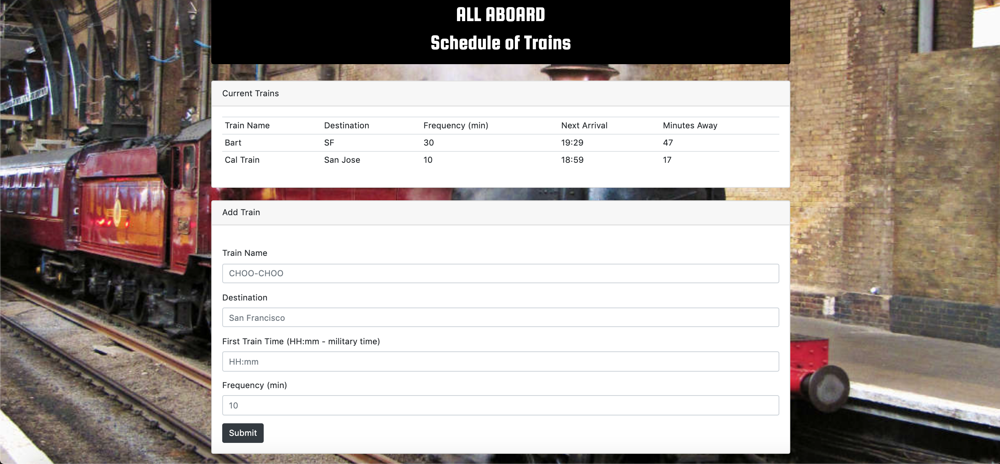

# Train-Scheduler

## Site Pictures

## Technologies Used
- HTML 
- CSS
- Git
- GitHub
- Javascript
- jQuery
- AJAX
- Firebase
- Moment JS

## Summary

Train Scheduler is a site where you can input data for trains including names, destination, frequency and first train time to be able to set them to a table that includes all of the previous information plus the minutes away of that train. This is all done thanks to firebase storing the information as well as moment js allowing us to convert and manipulate time inputs.

### Links
- [Train Scheduler](https://jerry-dudum.github.io/Train-Scheduler/)
- [LinkedIn](https://www.linkedin.com/in/jsdudum/)